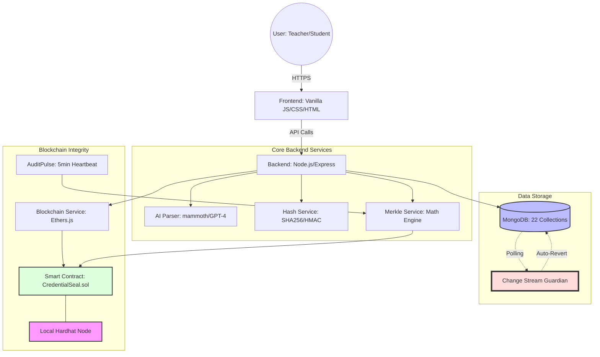

## 1. System Architecture
The platform follows a layered security architecture where the application logic and decentralized integrity checks are decoupled but continuously synchronized.

### Component Flow
1.  **Ingestion**: Teachers upload docs → **AI Parser** extracts MCQs & Images.
2.  **Execution**: Students take proctored exams → results saved to **MongoDB**.
3.  **Sealing**: Result hash is instantly anchored to **Blockchain**.
4.  **Monitoring**: **AuditPulse** creates periodic global state roots; **Guardian** auto-reverts any direct DB tampering.

---

## 2. Backend Architecture
The backend is a Node.js API that handles auth, exam lifecycle, and heavy AI/Document processing.

- **AI Parser Service**: A hybrid pipeline that converts `.docx` and `.pdf` files into structured MCQs. It uses `mammoth` for structural parsing and OpenAI GPT-4 as a fallback for complex medical diagrams.
- **Blockchain Interface**: Built using `ethers.js` to interact with Solidity smart contracts on a local Hardhat node.
- **Security Middleware**: Implements role-based access control (RBAC), proctoring enforcement (tab-switch detection, fullscreen locking), and request sanitization.

---

## 3. Database Schema (MongoDB)
The database consist of 22 specialized collections. Primary ones include:

| Collection | Role |
|---|---|
| **Users** | Stores identity, password hashes (bcrypt), and roles (Teacher/Student). |
| **Sessions** | Core "Exam" model containing questions, timing, and proctoring settings. |
| **MCQBanks** | Libraries of reusable medical questions with images. |
| **Results** | Individual student performance data including `blockchainTx`. |
| **ResultSnapshots** | **Immutable frozen copies** of results used for self-healing. |
| **AuditLogs** | Tracks "Global State Roots" anchored to the blockchain every 5 minutes. |

---

## 4. Blockchain & Integrity Layer
Security is enforced through **four independent layers**:

1.  **Item Hashing**: Every result is SHA256 hashed upon submission based on `score`, `answers`, and `violations`.
2.  **Per-Exam Anchoring**: Individual result hashes are sealed into the `CredentialSeal` smart contract on the blockchain.
3.  **Global Merkle Audit**: The `AuditPulse` service builds a Merkle Tree from all results and anchors the **Global Root** to the blockchain every 5 minutes. This creates a "time-stamp" of the entire database state.
4.  **Self-healing Guardian**: A background watcher scans results against `ResultSnapshots` every 60 seconds. If a manual edit (e.g., in MongoDB Compass) is detected, the Guardian **auto-reverts** the score to the original value within 1 minute.

---

## 5. Frontend Dashboards
The frontend is built with high-performance Vanilla JavaScript and standardized CSS tokens.

- **Teacher Command Center**: Features a real-time **Security Monitor** that shows red alerts if tampering is detected on the blockchain. Includes MCQ generation, session live-tracking, and result analytics.
- **Student Exam Engine**: A proctored environment with:
    - **Fullscreen Lock**: Blocks exit during exams.
    - **Face Monitoring**: Camera sidebar for proctoring.
    - **Image Zoom**: High-res viewing for medical diagrams.
- **Blockchain Verification Page**: Allows anyone with a `resultId` to verify the mathematical proof of the result against the blockchain record.

---

## 6. Deployment Status
- **Backend Node**: Active on port 5000.
- **Blockchain Node**: Local Hardhat active on port 8545.
- **Smart Contract**: `CredentialSeal` deployed at `0xe7f1725E7734CE288F8367e1Bb143E90bb3F0512`.
- **Database**: MongoDB active with `rs0` Replica Set (for Change Stream readiness).
